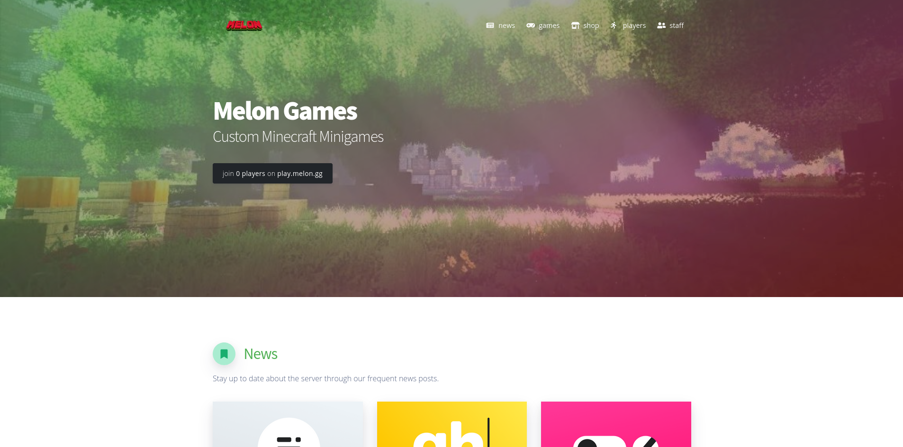
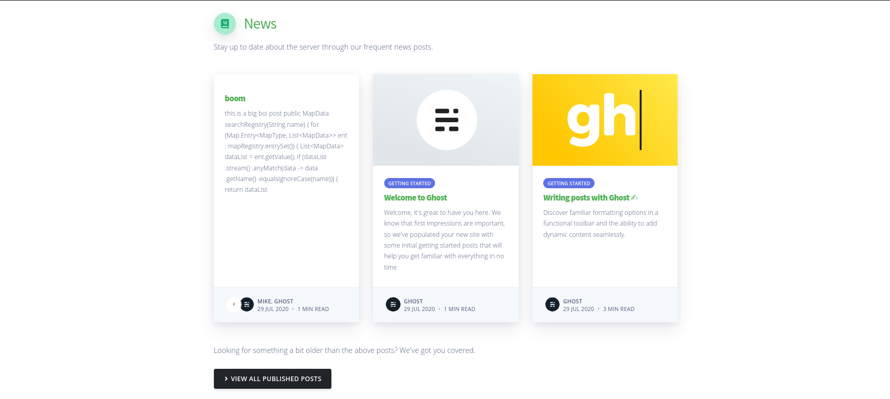
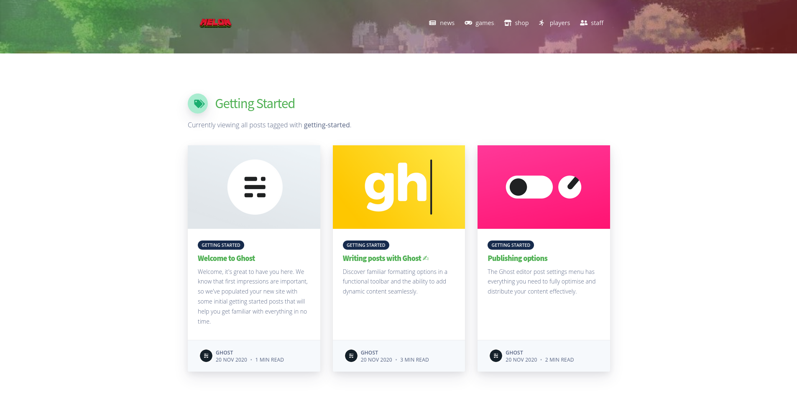
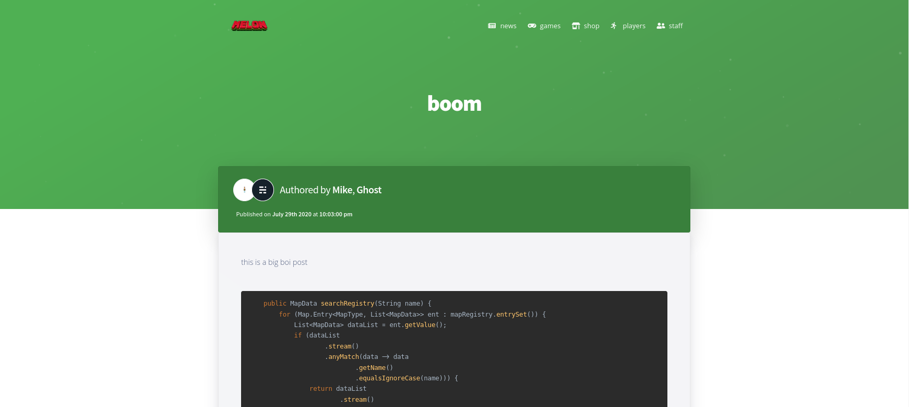
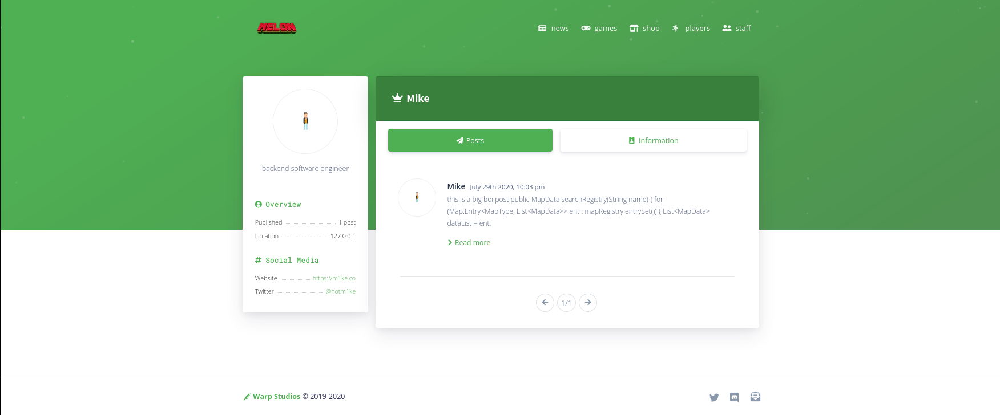

# Melon Ghost Theme

This repository contains a complete Ghost v3 theme used on the (now abandoned) Melon Games news website.

## Preamble

This Ghost theme was originally created for use on the Melon Games news page, however the site was decommissioned shortly after Melon Games was shut down in early 2021. Thus, this repository has been made public in the hope that it may be useful to someone else.

## Installation

Install this theme using the Ghost administration panel, more information can be found [here](https://ghost.org/help/installing-a-theme/).

## Images

### Home Page

### Post List Views

### Post View

This is a bit of an older image, with the only real difference between this and the version in this repository is the header differences.

### Profile View

Same as the post view, this is a bit of an older image before the header was updated.

## Contributing
Pull requests are welcome. For major changes, please open an issue first to discuss what you would like to change.

## License
[MIT](https://choosealicense.com/licenses/mit/)